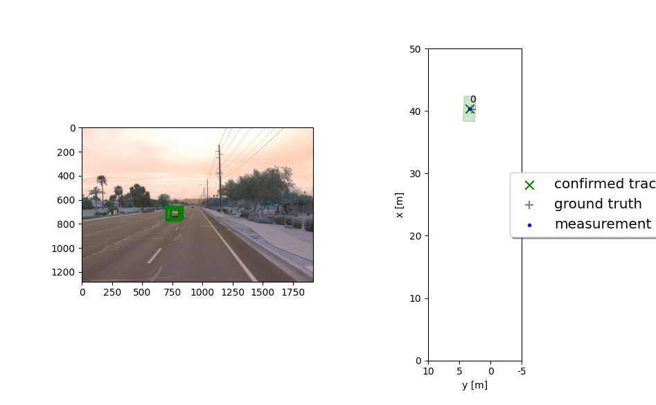
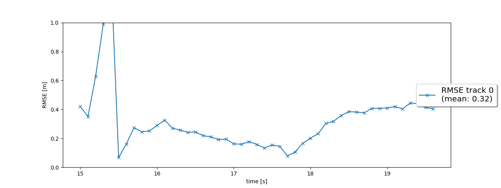
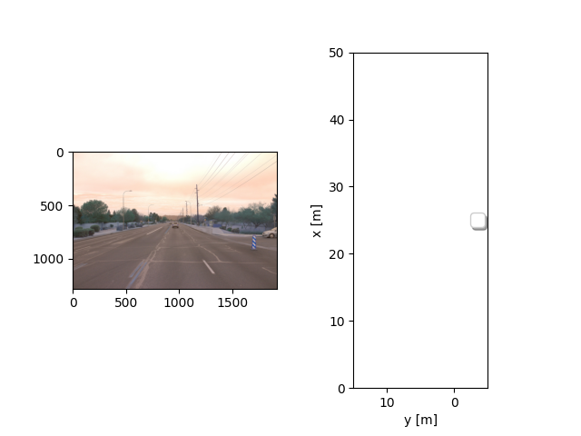
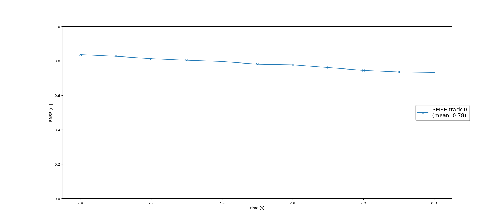
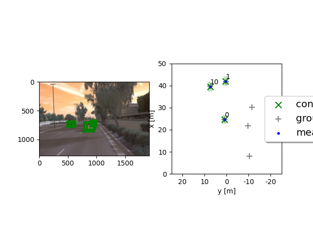
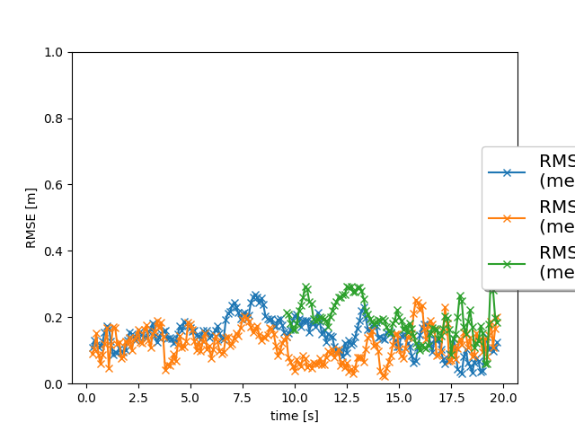
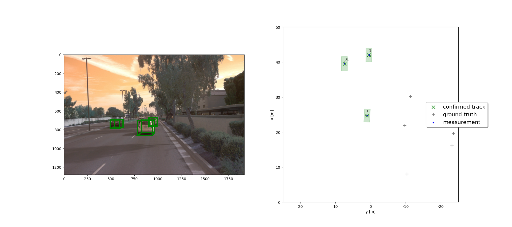
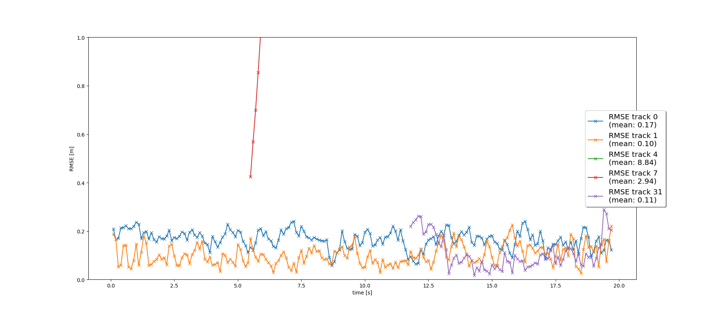

# Writeup: Track 3D-Objects Over Time

Please use this starter template to answer the following questions:

### 1. Write a short recap of the four tracking steps and what you implemented there (filter, track management, association, camera fusion). Which results did you achieve? Which part of the project was most difficult for you to complete, and why?
The first step is to implement the Extended Kalman Filter. The direct results are shown below:

The second step is to initiate track and keep maintaining track state and score of surrounding objects. The direct results are shown below with the diagram shows that the track was successfully deleted:

The third step implements the nearest neignbor association to the track detection so that the script could handle multiple tracks and keep proper monitoring on them. The direct results are shown below:

The fourth step implement the non-linear camera measurement model to utilize camera data to help get rid of ghost tracks. The final results show below with the two tracks tracked from beginning to end with RMSE lower than 0.25.

### 2. Do you see any benefits in camera-lidar fusion compared to lidar-only tracking (in theory and in your concrete results)? 
In theory, the camera should help with ghost tracks, because camera gives more RGB information that can be used to do segmentations of different object. The results showed that no track losses or ghost track exists. The RMSE also gives more promising results (lower RMSE) than no camera image.

### 3. Which challenges will a sensor fusion system face in real-life scenarios? Did you see any of these challenges in the project?
These are lots of tentative/potential tracks in the scenario of this project, given the fact that this scenario is not the busiest one an autonomous car would face. For instance, if the car travels inside big cities (e.g. NYC), there will be tons of potential tracks and some of them may even become confirmed depending on the threshold we choose. This could be a great challenge.

### 4. Can you think of ways to improve your tracking results in the future?
* Get better sensors (higher resolution, lower noise level camera/lidar)
* Fine tune parameters in params.py to make it better fits the scenario
* Utilizing more sensors (e.g. RaDAR)
* Add geometry model of cars so that the lidar and camera can identify cars around the host vehicle even better.
