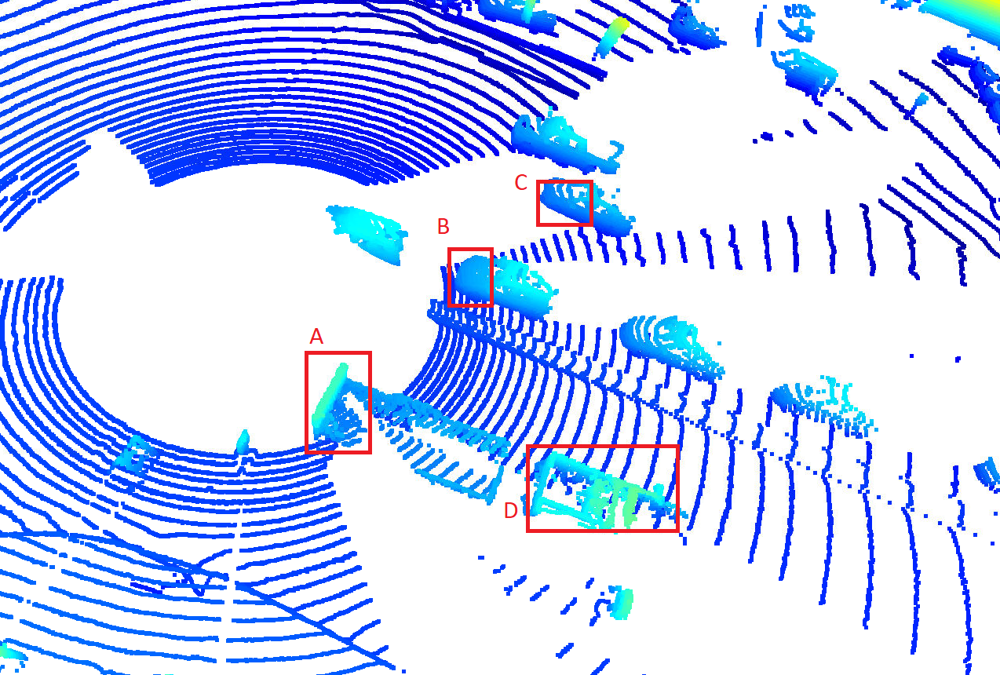

### Find 10 examples of vehicles with varying degrees of visibility in the point-cloud

As shown in the two images below. 7 cars and 5 cars are visible in the 3D lidar view (cars are bounded with red boxes):

### Try to identify vehicle features that appear stable in most of the inspected examples and describe them

In the first image, we can clearly see:
A: trailer
B&C: front hood of the cars
D: pickup truck trunk

In the second image, due to the distances of the cars, the point clouds density is very low and the features are hard to tell apart.